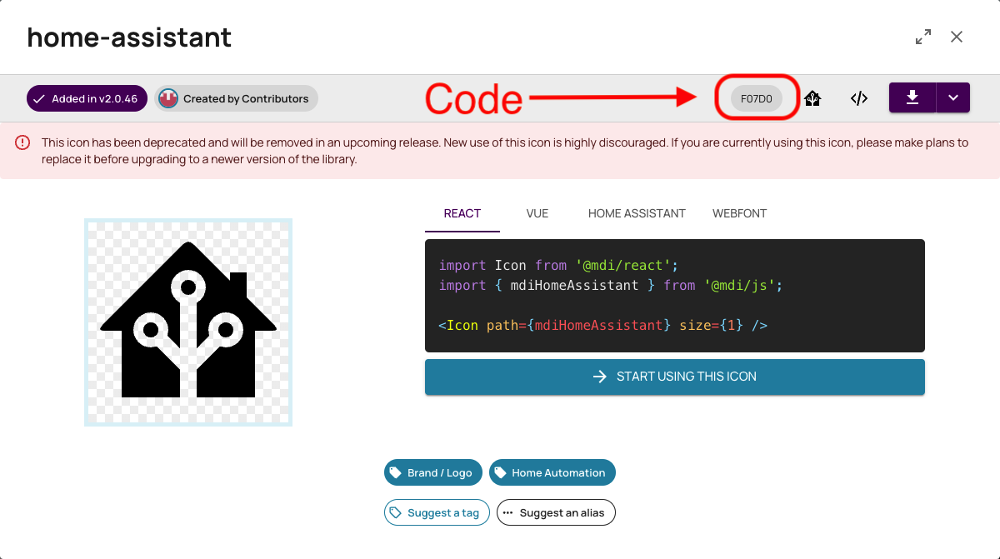

# Font

I recomend you download and put the TTF file in this folder.  
You can find the file on the Google GitHub page [here](https://github.com/google/material-design-icons/tree/master/font)  
To find the icon you need I recommend you use [Pictogrammers](https://pictogrammers.com/library/mdi/)

To use in ESPHome you will need the code shown below

