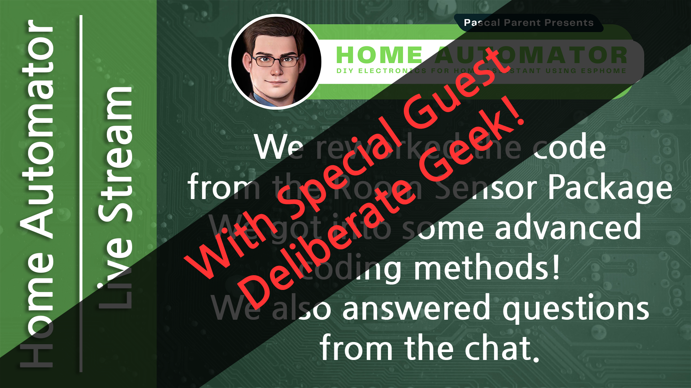

# ESPHome, Let's build a room sensor, Part 6

In this livestream, my guest Steve and myself moduralized our code and used advensed mothodologies to make it reusable and cleaner.

## Video

## Code

The code is found in the [code folder](./Code/)  
Please also read the [Fonts README file](./Code/fonts/README.md)!

## MCUs and sensors

**Disclaimer:** *The links bellow contains affiliate links. If you choose to make a purchase after clicking a link, I may receive a commission at no additional cost to you. Thank you for your support!*

### MCU

ESP32 D1 Mini
    - [South Africa - DIY Electronics](https://www.diyelectronics.co.za/store/iot/4311-esp32-wemos-mini-d1-development-board-wifi-bluetooth.html)
    - [US - Amazon](https://amzn.to/45XSDjq)
    - [Global - Aliexpress](https://s.click.aliexpress.com/e/_DCwAKh9)

ESP 32 NodeMCU
    - [South Africa - DIY Electronics](https://www.diyelectronics.co.za/store/espressif-iot/4445-nodemcu-32s-esp32-wifi-ble-development-board.html)
    - [US - Amazon](https://amzn.to/4eU5Xcl)
    - [Global - Aliexpress](https://s.click.aliexpress.com/e/_DemmYbt)

ESP32 S2 Mini
    - [South Africa - Micro Robotics](https://www.robotics.org.za/S2-MINI-S2FN4R2)
    - [US - Amazon](https://amzn.to/3RW0bNH)
    - [Global - Aliexpress](https://s.click.aliexpress.com/e/_DDB2z0f)

ESP32 S3 N16R8
    - [South Africa - Micro Robotics](https://www.robotics.org.za/ESP32-S3-N16R8)
    - [US - Amazon](https://amzn.to/3WcVdyv)
    - [Global - Aliexpress](https://s.click.aliexpress.com/e/_DdfNiDV)

Raspberry Pi Pico RP2040 W
    - [South Africa - PiShop](https://www.pishop.co.za/store/raspberry-pi-pico_0/raspberry-pi-pico-wh-with-pre-soldered-headers)
    - [US - Amazon](https://amzn.to/45Vmc4Y)
    - [Global - Aliexpress](https://s.click.aliexpress.com/e/_DCQ1sx1)

### Sensors

BH1750 Light Sensor
    - [South Africa - Micro Robotics](https://www.robotics.org.za/BH1750-MOD?search=bh1750%20light%20sensor)
    - [US - Amazon](https://amzn.to/3zzSXss)
    - [Global - Aliexpress](https://s.click.aliexpress.com/e/_Dcyx57N)

DHT22 Humidity and Temperature Sensor
    - [South Africa - PiShop](https://www.pishop.co.za/store/am2302-dht22-temperature-and-humidity-sensor-module)
    - [US - Amazon](https://amzn.to/45TEsvE)
    - [Global - Aliexpress](https://s.click.aliexpress.com/e/_Dk4CxSL)

HC-SR501 Passive Infrared Sensor
    - [South Africa - PiShop](https://www.pishop.co.za/store/pir-infrared-motion-sensor-hc-sr501)
    - [US - Amazon](https://amzn.to/3LcEZPw)
    - [Global - Aliexpress](https://s.click.aliexpress.com/e/_DeZyxgX)

SHT-40 Humidity and Temperature Sensor
    - [South Africa - Micro Robotics](https://www.robotics.org.za/SHT-40-QWIIC)
    - [US - Amazon](https://amzn.to/3zq30ju)
    - [Global - Aliexpress](https://www.aliexpress.com/item/1005006153556535.html)

SGP30 Air Quality Sensor
    - [South Africa - Micro Robotics](https://www.robotics.org.za/AF3709)
    - [US - Amazon](https://amzn.to/4buKx2B)
    - [Global - Aliexpress](https://s.click.aliexpress.com/e/_DdAQLCr)

### Other

Breadboard
    - [South Africa - Micro Robotics](https://www.robotics.org.za/FB830)
    - [US - Amazon](https://amzn.to/3xVBPg3)
    - [Global - Aliexpress](https://s.click.aliexpress.com/e/_DEyOtNZ)

Breadboard Power Supply
    - [South Africa - Micro Robotics](https://www.robotics.org.za/BREAD-PSU-533V)
    - [US - Amazon](https://amzn.to/3xVBPg3)
    - [Global - Aliexpress](https://s.click.aliexpress.com/e/_DmKSao7)

Jumper Wires
    - [South Africa - Micro Robotics](https://www.pishop.co.za/store/120pcs-20cm-color-breadboard-jumper-cable-wire-kit)
    - [US - Amazon](https://amzn.to/3xCvBlr)
    - [Global - Aliexpress](https://s.click.aliexpress.com/e/_DehKPiF)

U-Shaped Wires
    - [South Africa - Micro Robotics](https://www.pishop.co.za/store/breadboard-jumper-wire-kit-140pcs)
    - [US - Amazon](https://amzn.to/3XUJo1s)
    - [Global - Aliexpress](https://s.click.aliexpress.com/e/_DCT1mjZ)

3/5mm LED Kit
    - [South Africa - Micro Robotics](https://www.robotics.org.za/LED100-5MM-KIT)
    - [US - Amazon](https://amzn.to/4cvvVl2)
    - [Global - Aliexpress](https://s.click.aliexpress.com/e/_DdJbANl)

## Other useful or mentioned links

- [Let's build a room sensor - Part 0](/Lets_build_a_room_sensor/Part%200/README.md)
- [Let's build a room sensor - Part 1](/Lets_build_a_room_sensor/Part%201/README.md)
- [Let's build a room sensor - Part 2](/Lets_build_a_room_sensor/Part%202/README.md)
- [Let's build a room sensor - Part 3](/Lets_build_a_room_sensor/Part%203/README.md)
- [Let's build a room sensor - Part 4](/Lets_build_a_room_sensor/Part%204/README.md)
- [Let's build a room sensor - Part 5](/Lets_build_a_room_sensor/Part%204/README.md)
- [Installing and configuring Home Assistant](/Tutorial%201%20-%20Basic%20Setup%20for%20all%20Devices/README.md)
- [Let's install the ESPHome Add-on](https://youtu.be/zwykvV82SGw?si=XLMDUKdHiqi_dprt)
